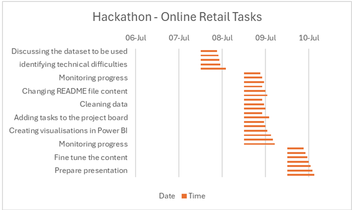

# 

# Hackathon Project - Online Retail Business Analysis

## Introduction
This analysis project will focus on customer behaviour concerning one online business. The business sells a wide variety of products from low value to high value. The business aims to make a profit and increase its share of the very competitive online market. The growth of the business may be impeded by trade agreements, inflation, and interest rates of which affect the level of spending.

## About the business
 The business has many customers from various geographic regions across the world. The majority of the sales revenue was generated in the UK domestic market, which may reflect that it has become more established and familiar to customers in the UK. However, the dataset reveals a different insight elsewhere across the world, where customer spending is not so great. 

|__Region__|__Total Revenue__|
|----------|-----------------|
|UK|~£90M|
|Europe|~£1.4M|
|Oceania|~£138K|
|Asia|~£74K|
|Other|~£28K|
|Middle East|~£10K|
|North America|~£7K|

* The table above reflects the income streams and their respective amounts,

## Dataset Content
* The "Online Retail Transaction" dataset contains information about customers' transactions who are located in various countries across the world. The dataset features allow the business to understand customer spending behaviour and the spending trends from nation to nation. In terms of products, they vary and the demand for which will be affected by economic factors. The dataset consists of one table from which data insights will be generated.

## Business Requirements & Purpose

* It is through the insights of this project that we can identify market segments based on customer spending amounts and frequency, location and the type of products they have purchased. This will allow this business to inform customers about new products and introduce pricing strategies to encourage customers to spend. This will enable this online business to:

* Improve customer retention

* Identify sales trends

* Predict product demand

* Inform customers about new products, so they continue to spend

* Inform customers about offers who do not spend so frequently

## Project Plan
* The plan followed the waterfall methodology in the following ways:
* Requirements: The project outline was defined and goals identified along with respective roles
* Design: The dataset would be cleaned and additional columns were added 
* Development: The data was manipulated to generate the set insights into customer behaviour
* Testing:  Ensuring the vsiualisations were inline with project objectives
* Deployment: creation of the visualisations in Jupyter notebooks and Power  BI dashboard
* Maintenance: storing of data and visualisations in appropriate files to ensure maintainence and integrity.

### GANNT Chart

## The rationale to map the business requirements to the Data Visualisations
* List your business requirements and a rationale to map them to the Data Visualisations
The rationale behind the visualisations are as follows:
* To understand the consumer behaviour in different global geographic regions
* To understand the size of the customer base for this online business
* To improve upon sales revenue in all countries by using marketing and pricing strategies
* To identify customers who spend the least and the most
* To identify popular and unpopular products in order to increase sales

## Analysis techniques used

The business aims to increase sales turnover and market share were at the forefront of our minds. Therefore, making sure the data was clean from duplicates, negative values and missing entries. This would give us a clear picture and insight into how the business was trading.

There is only one table, so we were limited to what we could glean from the data. Therefore, we had to create additional columns and group column headings to generate further insights. The was no economic data or information on how long the business had been trading online.

AI tools helped in coding for Power BI to create new column headings and solve issues with the virtual environment.

## Ethical considerations

Privacy was maintained by using ID's for each customer. All data is stored and protected inline with international data legislation.

## Dashboard Design
* Dashboard pages are as follows:
Line chart – 
Line chart and trendline
Bar chart -
Heat map - 

* How were data insights communicated to technical and non-technical audiences?
The language that was used was explained in layman's terms and accompanied by appropriate visualisations for those who were non-technical, so that they could get an initial insight and then be more informed using a variety of visualisations. For the technical audiences, there was more use of technical terminology and more involved visualisations.

* The dashboard includes a variety of plots ranging from bar charts to a report giving a more in-depth analysis.

## Development Roadmap
* What challenges did you face, and what strategies were used to overcome these challenges?
The main challenge was setting up the virtual environment after cloning the repository. PowerShell worked for some, while Git Bash was used otherwise.

* What new skills or tools do you plan to learn next based on your project experience? 

## Main Data Analysis Libraries
* Here you should list the libraries you used in the project and provide an example(s) of how you used these libraries.
* Pandas
* Plotly

## Credits 

* Kaggle - Online Retail Dataset
* Git Working Practice - Code Institute
* LMS  - Code Institute

## Acknowledgements (optional)
* Emma Lamont, Sylvester, Richard and Ray